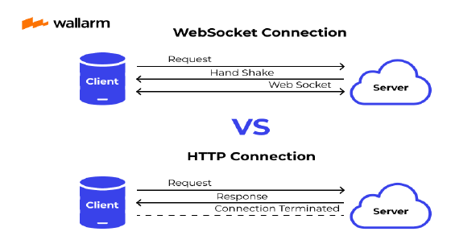
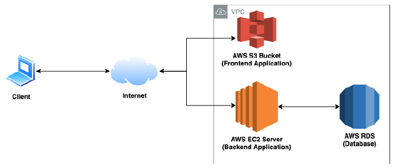
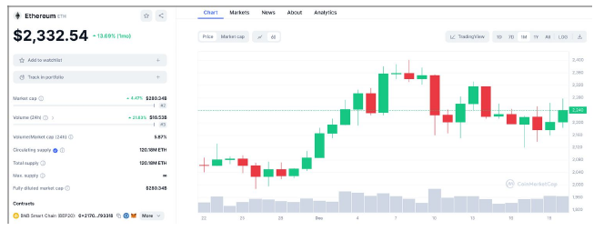

# Global-Crypto-Market-Continuous-Data-Extraction

## Background

The cryptocurrency market operates globally and has millions of transactions. However, accessing and analyzing real-time data across multiple platforms remains a challenge. Current solutions lack hardware timestamp synchronization, historical data storage, and open-source accessibility. This project will bridge that gap by creating real-time synchronized data that is openly accessible from a server platform.

## Introduction

The primary objectives of this project include first developing a low-latency real-time data extraction system from multiple cryptocurrency exchanges using hardware timestamping. Next, implementing an AWS-based scalable database for historical analysis. Third, building a publicly accessible data option for open-source downloads and data visualization. The project will be open source, and all collected data will be free and openly accessible to the public domain. While there are similar options available that are direct competitors, this project will be the first completely open-source and free option for historical and real-time cryptocurrency data from multiple exchanges. Additionally, there are open-source projects that collect from multiple crypto APIs, but they do not have the benefits of low-latency timestamping due to hardware timestamps, stored historical data, or a front-end.

This project is being conducted with Professor Lariviere in the IE department because of his experience in financial market data analysis. The collaboration will allow the team to explore high-frequency trading (HFT) techniques and methods for low-latency data collection and storage that can be applied to cryptocurrency markets. This research and project aligns with current work in financial regulation, cryptocurrency exchanges, and software development for trading.

## Technical Breakdown: Components

This project heavily focuses on ECE topics as it implements networking, high-performance computing, database management, and cloud infrastructure skills. The team plans to use WSL/Linux development for API integration and networking. This includes WebSocket API connections for market data collection. C will be the primary programming language for this portion of the project. For the later parts of data storage and formatting, the team will use a combination of Python and C++. In addition, GitLab will be used for task distribution and version control. The front end will potentially make use of JavaScript and React. These components and their relation to ECE will be discussed in further detail below.

The system will connect to multiple cryptocurrency exchange APIs via WebSockets to collect live trade, order book, and price data. Unlike other APIs that require periodic polling, WebSockets provide continuous real-time data streams, reducing latency and improving efficiency. This will require C to configure the libwebsockets package to collect hardware timestamps and manage real-time WebSocket connections. Multiple cryptocurrency exchange APIs will be integrated using threading to collect simultaneous hardware timestamps. Using hardware timestamps provides benefits over software timestamping by minimizing delays due to interrupts or other OS-level conflicts. The discrepancy between WebSocket connections and HTTP requests is shown in Figure 1. The difference in timestamps of this project compared to other projects is that there will be an additional hardware timestamp recorded after the data packets have been placed into the socket and received on the physical machine.

 
*Figure 1: Comparison of WebSocket and HTTP Connection Models*

Data will be stored on an AWS server after being collected. The collection and formatting will be done with Python and C++, allowing for simple data manipulation and will not negatively impact the project, even with the higher latency of Python compared to C. To allow for historical data storage, DynamoDB or RDS will be used to store data. This, combined with Kinesis Streams, will allow for storage of real-time updates to pricing and additional data after it has been collected. Additionally, S3 + CloudFront will be used for site hosting, connecting AWS to the frontend site for users to access the data. AWS will allow a robust cloud storage platform to hold a large quantity of stored historical data and provide an easy-to-operate user interface. Figure 2 depicts on a highly simplified scale the frontend and backend components of web application deployment using AWS that a public user will be able to access.

 
*Figure 2: AWS Cloud Architecture*

The project's third component will be a data visualization method and front-end development. This will allow users to access the stored real-time and historical data. A real-time data access point will be implemented with current pricing information and historical data using Javascript and React. This data will also be accessible directly from the AWS server. Front-end development, however, will make the data accessible to all users, not just those who know how to download directly from the server. By developing a front end hosted on S3 and CloudFront, it will be possible to have data openly accessible and potentially expand to displaying charts and graphs to accompany the raw data. Figure 3 shows a concept design of what the frontend UI will look like. The goal is to have a simple and easy-to-use interface with options such as a continuous display of real-time price fluctuations and historical data. If there is extra time, potential additional features include analytics, advanced graphics, tracking features, and a built-in news panel.

 
*Figure 3: Example Price Chart and Market Data Overview*

## Conclusion

This project integrates core ECE concepts, including low-latency networking with hardware timestamps and writing and modifying C code to connect to APIs and extract data. It also incorporates cloud computing, big data processing, and compression through AWS, SQL, and other cloud computing applications. Finally, a front-end component will be designed using Javascript and React. All of this will be done through WSL for ease of working with C libraries, and the project will be stored on GitLab for accessible version control and task management. Ultimately, the finished product will be a DevOps pipeline of continuous data extraction, synchronization/compression and analysis, and storage/display via AWS services. This project is open source and provides the first free access to historical and real-time global crypto market data. This project will also help detect market manipulation by analyzing price movements across unregulated cryptocurrency exchanges. This not only advances crypto market transparency but also provides a foundation for future projects. The historical data can be used for financial regulation, trading strategies, and data analysis. For this reason, it incorporates a wide range of ECE skills and potentially leaves a real-world impact by providing easily accessible open-source data. The diagram (Figure 4) below illustrates a high-level overview of the entire project pipeline.

 
*Figure 4: Market Data Extraction Pipeline*

## Authors

| Name               | GitHub                                  | LinkedIn |
|--------------------|------------------------------------------|----------|
| Justin Bucsa       | [jbucsa](https://github.com/jbucsa)       | [![LinkedIn][linkedin-shield]][linkedin-url-Bucsa] |
| Jimmy McLaughlin   | [jmclaughlin19](https://github.com/jmclaughlin19) | [![LinkedIn][linkedin-shield]][linkedin-url-McLaughlin] |
| Cameron Marchese   | [cam8240](https://github.com/cam8240)     | [![LinkedIn][linkedin-shield]][linkedin-url-Marchese] |
| Jacob Poeschel     | [jacobop2](https://github.com/jacobop2)   | [![LinkedIn][linkedin-shield]][linkedin-url-Poeschel] |
| Meredith Naylor    | [mcnaylor03](https://github.com/mcnaylor03) | [![LinkedIn][linkedin-shield]][linkedin-url-Naylor] |

[linkedin-shield]: https://img.shields.io/badge/-LinkedIn-black.svg?style=for-the-badge&logo=linkedin&colorB=555  
[linkedin-url-Bucsa]: https://www.linkedin.com/in/justin-bucsa  
[linkedin-url-McLaughlin]: https://www.linkedin.com/in/james-mclaughlin-/  
[linkedin-url-Marchese]: https://www.linkedin.com/in/cam8240/  
[linkedin-url-Poeschel]: https://www.linkedin.com/in/jacob-poeschel/  
[linkedin-url-Naylor]: https://www.linkedin.com/in/meredith-naylor/
